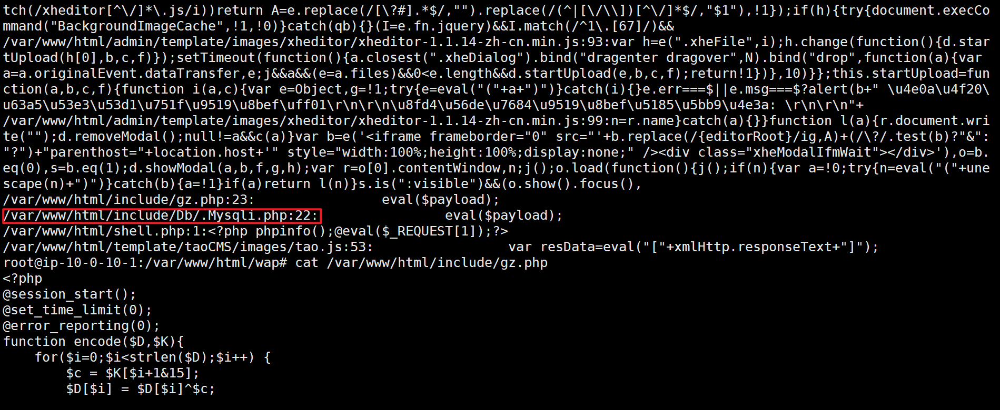
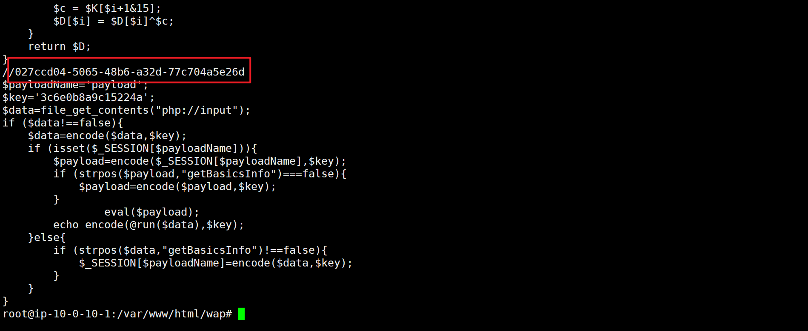
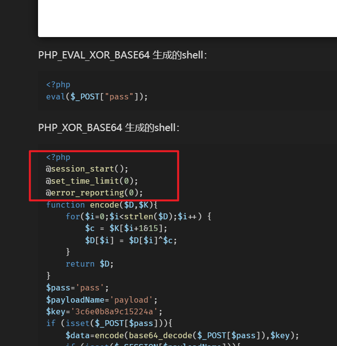
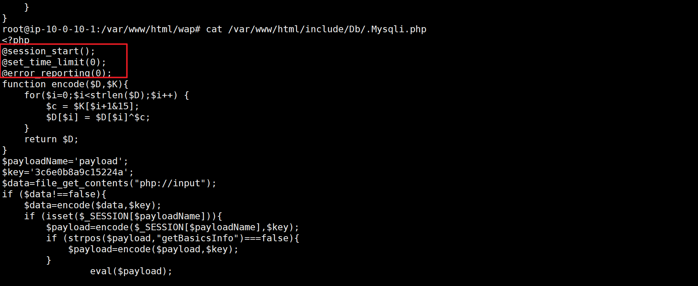
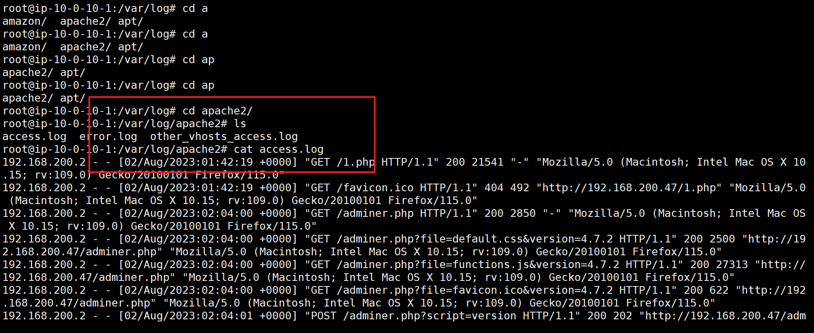
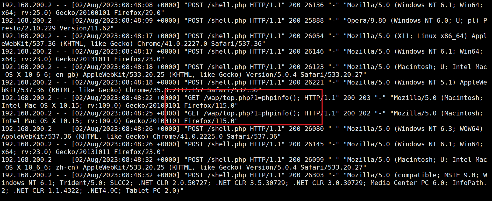

grep -rnw "/var/www/html" -e "eval"
大概意思就是递归查询目录的文件，匹配整个-e的字符串，并且会输出字符串的行号
发现了gz.php中有eval函数
1.黑客webshell里面的flag flag{027ccd04-5065-48b6-a32d-77c704a5e26d }
  

2.黑客使用的什么工具的shell github地址的md5 flag{md5}
通过前三段发现是哥斯拉工具，地址为：https://github.com/BeichenDream/Godzilla
flag{39392de3218c333f794befef07ac9257}
https://www.cnblogs.com/smileleooo/p/18178347

  
3.黑客隐藏shell的完整路径的md5 flag{md5} 注 : /xxx/xxx/xxx/xxx/xxx.xxx
在linux中，文件前面有.号就会被视为隐藏文件或者文件夹
flag{aebac0e58cd6c5fad1695ee4d1ac1919}
  
4.黑客免杀马完整路径 md5 flag{md5}
一般webshell都要去访问一次，要让服务器进行解析，所以会有日志访问记录
flag{eeff2eabfd9b7a6d26fc1a53d3f7d1de}
  
  

