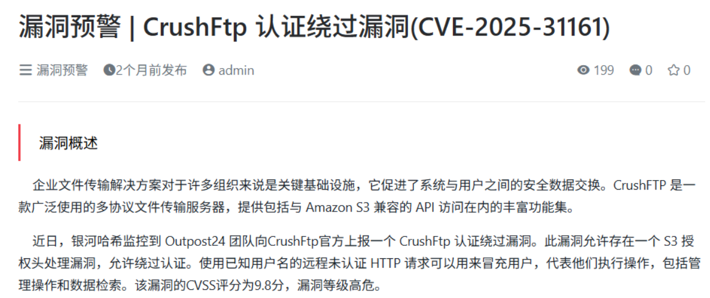
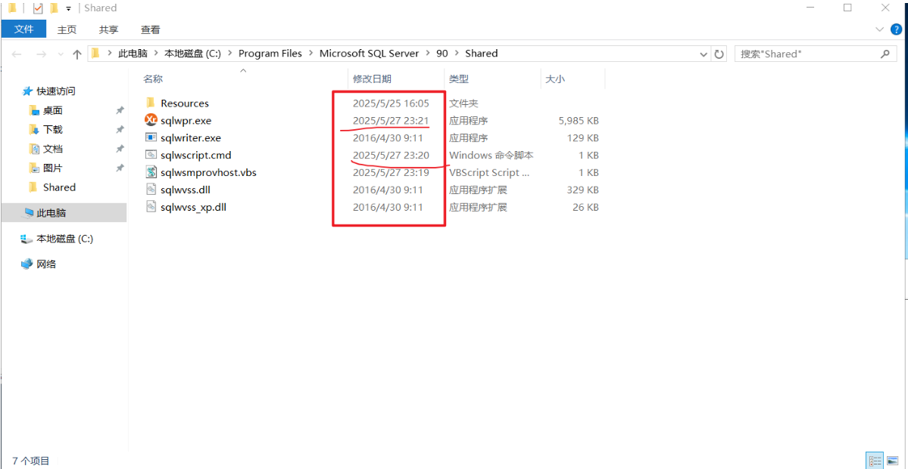
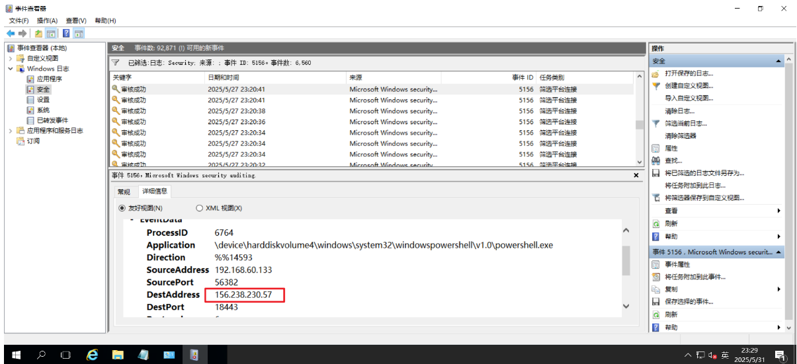
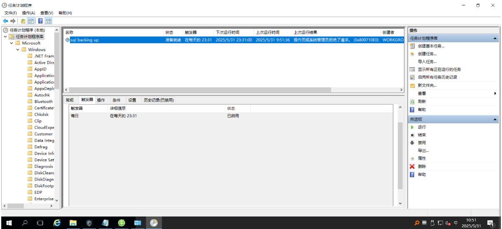
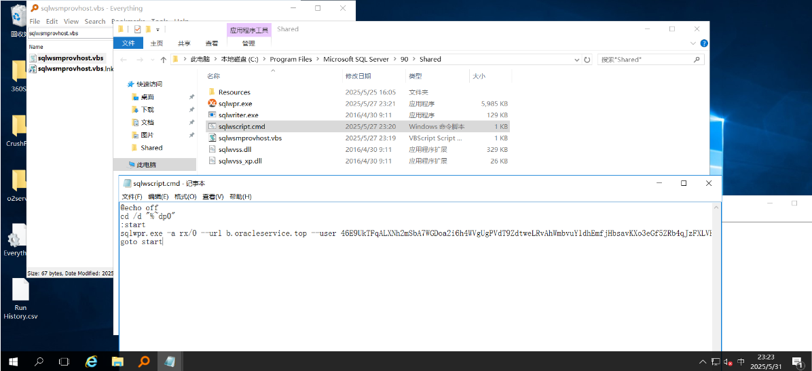
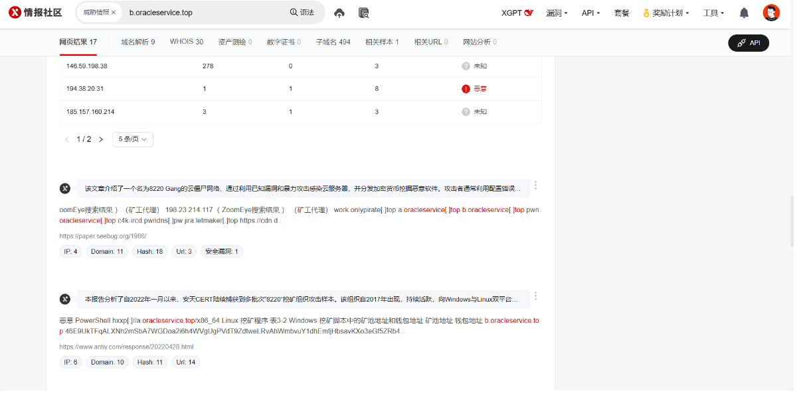

## 题目1：攻击者使用什么漏洞获取了服务器的配置文件？

发现服务，去搜索对应可能会使用到的漏洞CVE编号
  flag{CVE-2025-31161}

 

## 题目2：攻击者C2服务器IP是什么？

flag{156.238.230.57}
攻击者的大概时间

然后去事件日志查找事件id为5156

## 题目3：系统每天晚上系统都会卡卡的帮小明找到问题出在了那？

flag{sqlbackingup}
  

## 题目4：恶意域名是什么？

flag{b.oracleservice.top}

## 题目5：疑似是什么组织发动的攻击？

flag{8220Gang}

