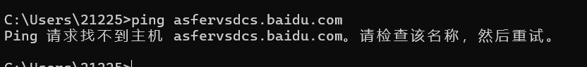
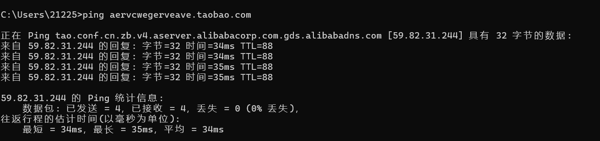

泛域名解析是：*.域名解析到同一IP。
域名解析是：子域名.域名解析到同一IP。

首先判断是否存在泛域名解析：
比如从淘宝和百度来说：
随便拼一个百度不存在的二级域名，是ping不通的

但是随便输入一个淘宝的二级域名就会ping通，这就是使用到了泛域名解析

```
检测泛解析的python脚本

import dns.resolver
import random
import string

def generate_random_subdomain(length=10):
    """生成随机子域名"""
    return ''.join(random.choices(string.ascii_lowercase + string.digits, k=length))

def check_wildcard_resolution(domain):
    """检查域名是否存在泛解析"""
    try:
        # 生成两个不同的随机子域名
        subdomain1 = f"{generate_random_subdomain()}.{domain}"
        subdomain2 = f"{generate_random_subdomain()}.{domain}"

        # 查询两个随机子域名的A记录
        answers1 = dns.resolver.resolve(subdomain1, 'A')
        answers2 = dns.resolver.resolve(subdomain2, 'A')

        # 提取IP地址
        ips1 = [str(rdata) for rdata in answers1]
        ips2 = [str(rdata) for rdata in answers2]

        # 如果两个随机子域名都能解析到IP，且IP集合相同，则判定存在泛解析
        if ips1 and ips2 and set(ips1) == set(ips2):
            return True, ips1
        else:
            return False, []
    except (dns.resolver.NXDOMAIN, dns.resolver.NoAnswer):
        # 如果任一随机子域名无法解析，则不存在泛解析
        return False, []
    except Exception as e:
        print(f"发生错误: {e}")
        return False, []

if __name__ == "__main__":
    target_domain = input("请输入要检查的域名: ").strip()
    has_wildcard, ips = check_wildcard_resolution(target_domain)

    if has_wildcard:
        print(f"域名 {target_domain} 存在泛解析")
        print(f"泛解析IP地址: {', '.join(ips)}")
    else:
        print(f"域名 {target_domain} 不存在泛解析")
```
如何突破泛解析得到真实的二级域名

一般情况，一个域名的DNS解析会有不同的记录类型的
CNAME记录：是一种DNS记录，用于将一个域名指向另一个域名，而不是直接指向IP地址
A记录：直接把域名映射到一个IP地址

1.CNAME查询
如果多个不会存在的域名解析了同一个域名，子域名挖掘时会指向这个域名的都是无效域名

2.A记录记录查询次数
思路：A记录查询发现某个IP地址的命令次数超过一定次数，那么后续A记录解析结构就不再显示该IP地址的子域名
