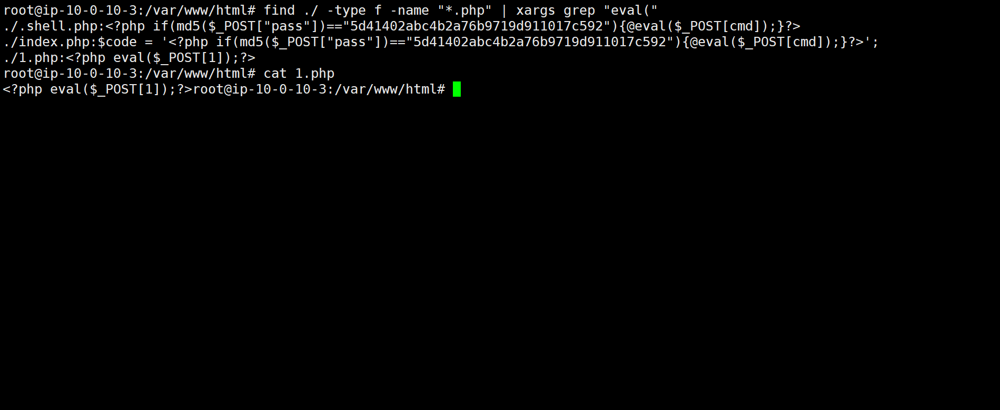
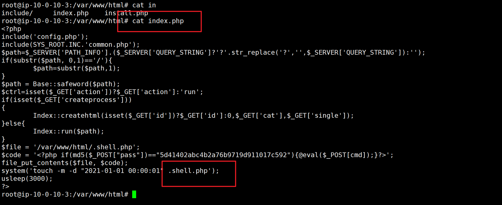
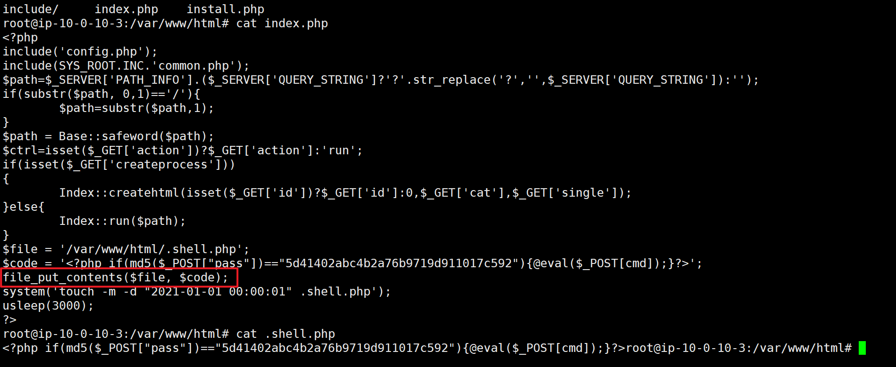
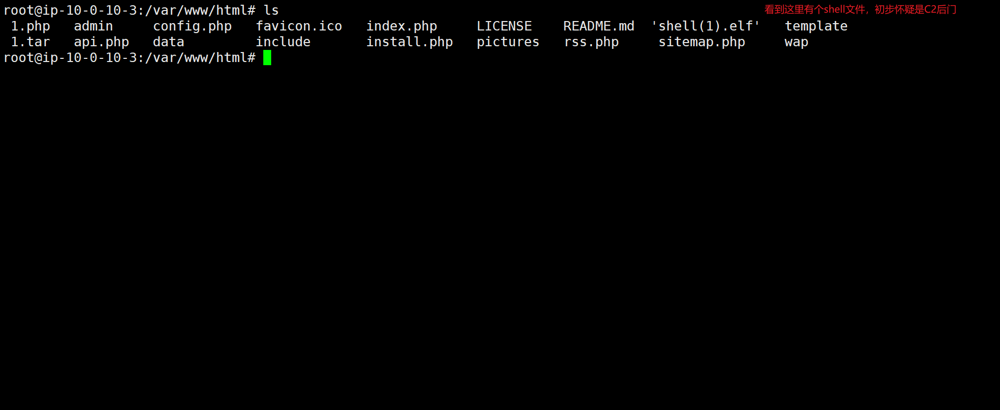
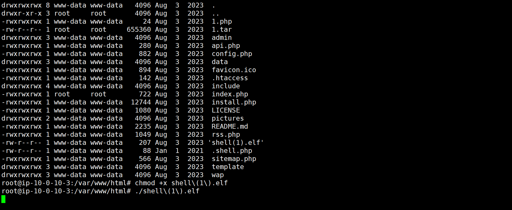
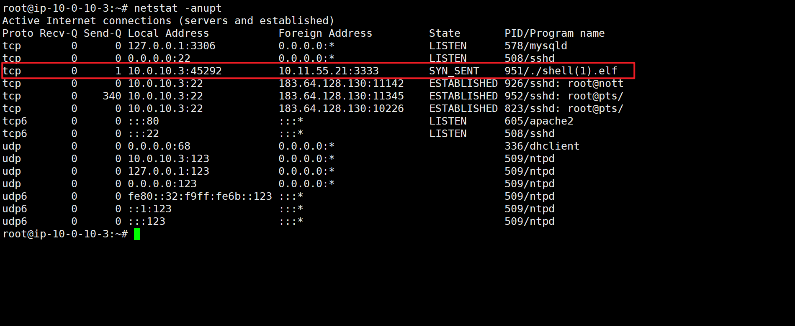

### 1.web目录存在木马，请找到木马的密码提交

```
find ./ -type f -name "*.php" | xargs grep "eval("

find用于搜索文件和目录的命令
./表示当前目录以及子目录 ../表示上层目录以及子目录
-type f 表示只搜索文件（不包括目录）
-name "*.php" *通配符（表示0个或多个）只搜索文件后缀为.php的文件
| 管道符指将前一个命令的输出作为下一个命令的输入。
xargs 将输入的数据转换成命令行参数，将|前面的输出传给grep
grep "eval(" 搜索包含字符串eval的行 
```

这里查找到3个文件，其中1.php明显为一句话木马，密码为1



### 2.服务器疑似存在不死马，请找到不死马的密码提交

```
不死马的特征：
1. 进程常驻与无线循环	while死循环结合usleep(5000)
2. 自我删除与隐蔽性		 会调用unlink(__FILE__) 常用.开头的文件，在linux中会隐藏
3. 定时生成后门文件		 调用file_put_contents向指定路径写入恶意代码，且可以更改创建时间
4. 后门访问控制		  常用md5校验机制

清除不死马方法：
1. 需终止进程 使用kill杀进程
2. 竞争覆盖 用代码快速写入覆盖后门文件
3. 重启web服务器
```




### 3.不死马是通过哪个文件生成的，请提交文件名

查找了index.php用了file_put_contents函数，并且还会更改文件创建的时间



### 4.黑客留下了木马文件，请找出黑客的服务器ip提交

```
ELF文件是Linux/Unix系统中最核心的可执行文件格式
```



给文件执行的权限执行文件



用netstat命令查看网络连接情况

```
netstat -anupt 也可以用 ss -anupt
netstat是拿来系查看系统的网络连接状态
-a显示所有项，-n能显示成数字的显示成数字，-u显示所有UDP的，-t显示所有TCP的，-p表示显示程序名以及PID
```



### 5.黑客留下了木马文件，请找出黑客服务器开启的监端口提交

上面的攻击地址后面的3333端口
