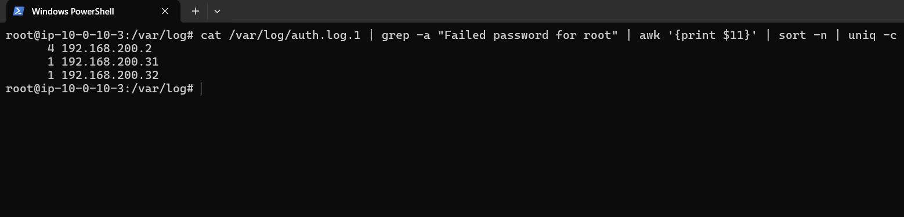
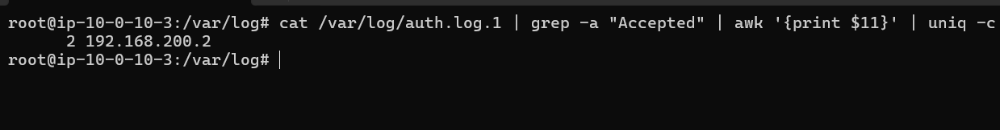
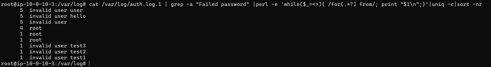
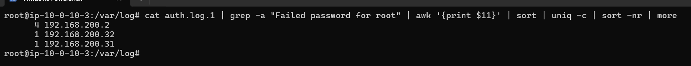

```
常见日志文件：
/var/log/syslog：记录系统的各种信息和错误
/var/log/auth.log：记录身份验证相关的信息，如登录和认证失败
/var/log/lastlog：记录系统中所有用户最近一次登陆的信息	执行 last 命令，它会读取/var/log/wtmp文件的内容。并把该文件记录的用户登录历史全部显示出来 w命令能够显示当前用户在干什么 users命令显示当前登录的用户
/var/log/apache2/：记录Apache日志
/var/log/nginx/：记录Nginx服务器的访问和错误日志（若安装了Nginx）
/var/log/mysql：记录mysql数据库的日志
/var/log/redis：记录redis的日志
/var/log/btmp：记录登录失败的日志
/var/log/wtmp：记录登录成功的日志

顺便记一下windows常见的事件ID：
4624：登录成功
4625：登录失败
7045：服务创建成功
5156：网络连接
4688：进程创建
```

1.有多少IP在爆破主机ssh的root帐号，如果有多个使用","分割

flag{192.168.200.2,192.168.200.31,192.168.200.32}

```
cat /var/log/auth.log.1 | grep -a "Failed password for root" | awk '{print $11}' | sort -n | uniq -c

-a 选项表示将文件内容视为文本文件
awk 是一个文本处理工具，用于按字段处理文本。
{print $11} 表示打印每行的第11个字段。假设日志格式为标准格式，第11个字段通常是IP地址。
sort 进行排序
uniq 删除重复的行
-c选项表示对每个唯一的行计数，即统计每个IP地址的出现次数。
sort 命令再次用于排序
-n 选项表示按数值进行排序 
-r 选项表示按降序排序	reverse（翻转），默认是升序
more 命令用于分页输出
```



2.ssh爆破成功登陆的IP是多少，如果有多个使用","分割

```
 cat /var/log/auth.log.1 | grep -a "Accepted" | awk '{print $11}' | uniq -c
```



3.爆破用户名字典是什么？如果有多个使用","分割

```
cat /var/log/auth.log.1 | grep -a "Failed password" |perl -e 'while($_=<>){ /for(.*?) from/; print "$1\n";}'|uniq -c|sort -nr

perl -e 'while($_=<>){ /for(.*?) from/; print "$1\n";}':
作用：使用Perl脚本从每一行提取出失败登录尝试的用户名。
while($_=<>)：逐行读取输入。
/for(.*?) from/：使用正则表达式匹配模式“for [username] from”，其中[username]是登录尝试的用户名。
print "$1\n"：将提取的用户名打印出来。
```



4.登陆成功的IP共爆破了多少次

```
cat auth.log.1 | grep -a "Failed password for root" | awk '{print $11}' | sort | uniq -c | sort -nr | more
```



5.黑客登陆主机后新建了一个后门用户，用户名是多少

```
 cat auth.log.1 | grep -a "new user"
 新建用户的关键字为"new user"，那么删除用户的关键字为"deleted user"
```


