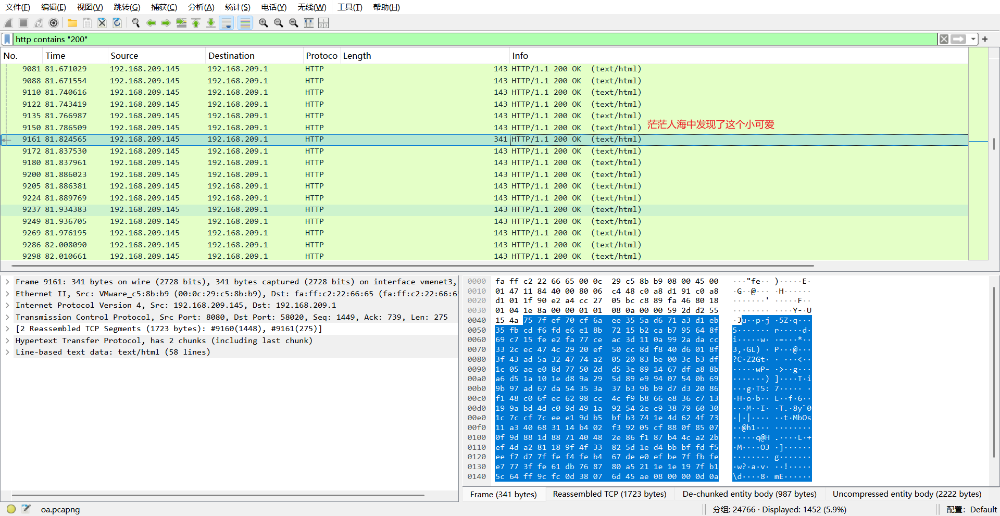
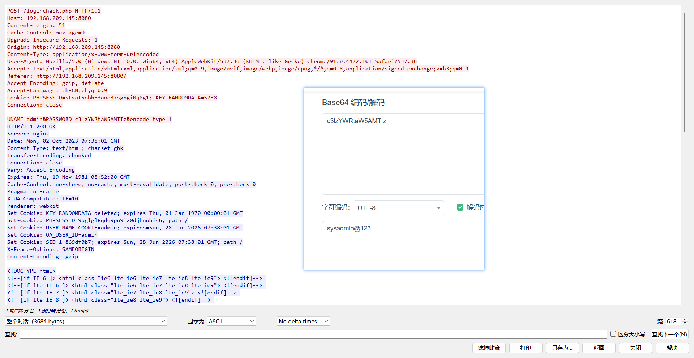
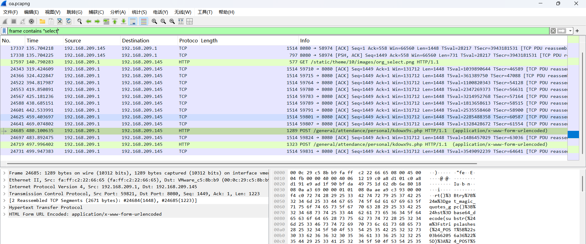
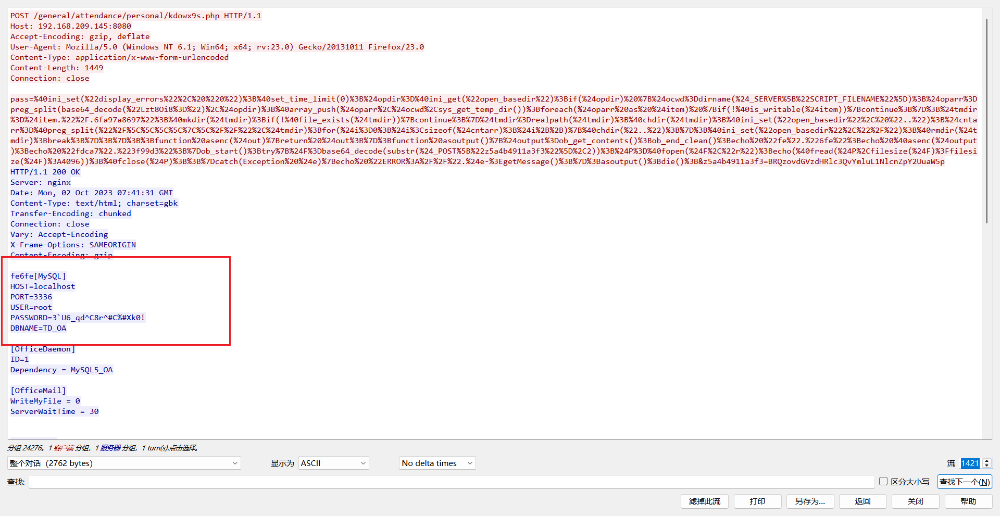
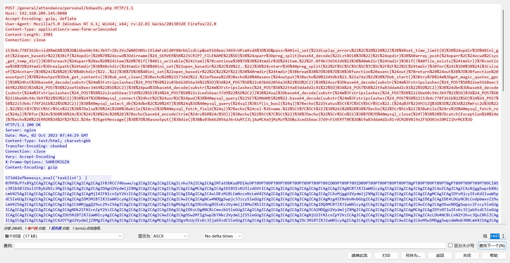

```

找到以下信息：
1. hacker对目标系统进行用户爆破，成功登陆后台的帐号密码是什么？（格式： 用户名/密码 如test/123456）
2. mysql数据库密码是什么？（格式：密码     如 123456）
3. hacker通过mysql执行的最后一个系统命令是什么？（格式： 命令   如 calc）

Flag提交格式：
将三个问题的答案通过“-”符号拼接，然后计算md5值进行提交.
示例：
答案1: test/123456
答案2: 123456
答案3: calc
则拼接为 test/123456-123456-calc 后计算出md5：
52a1a602f96bbc2c8d9bbd03e759693c
则最终提交的内容为：
flag{52a1a602f96bbc2c8d9bbd03e759693c}


最终答案：
admin/sysadmin@123
3`U6_qd^C8r^#C%#Xk0!
tasklist
```

1.hacker对目标系统进行用户爆破，成功登陆后台的帐号密码是什么？（格式： 用户名/密码 如test/123456）





2.mysql数据库密码是什么？（格式：密码     如 123456）一个综合配置文件（OA常用）





3.hacker通过mysql执行的最后一个系统命令是什么？（格式： 命令   如 calc）
   tasklist 查看进程列表，渗透中常用于杀软识别


