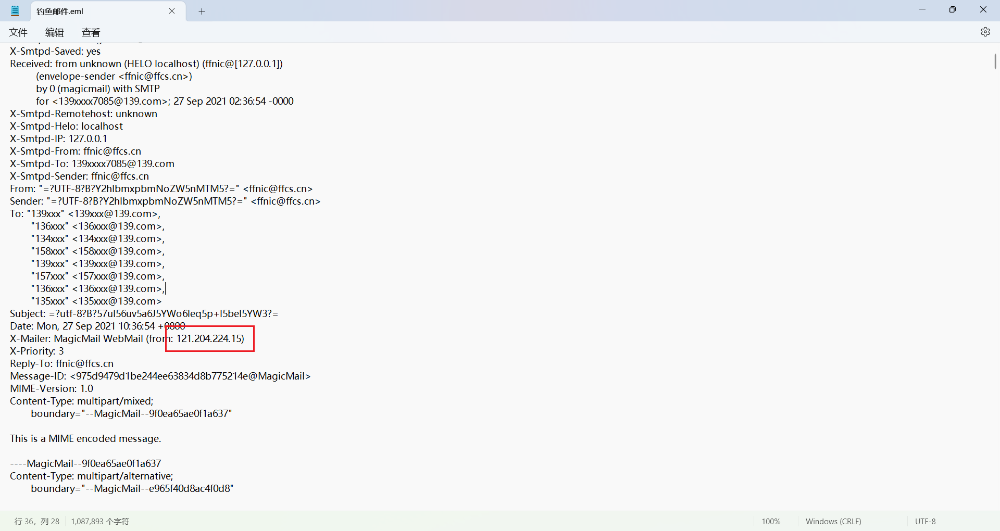
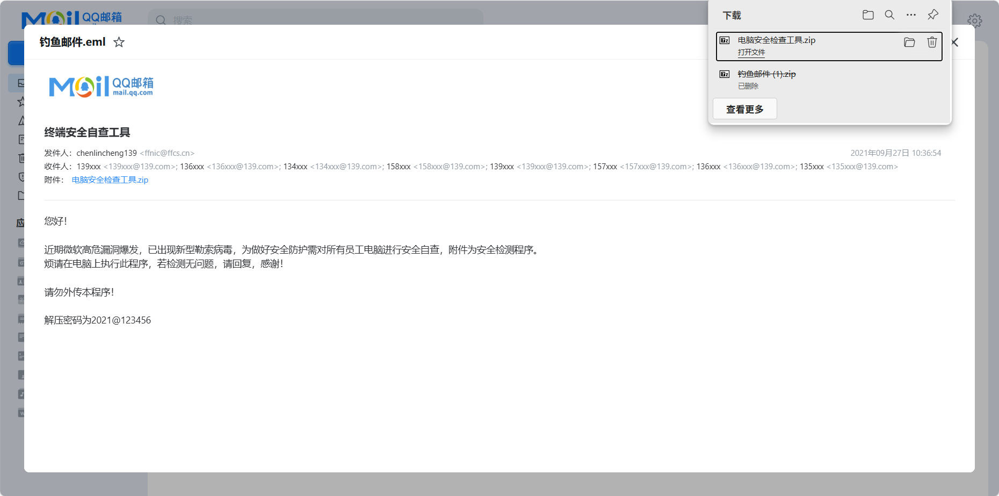
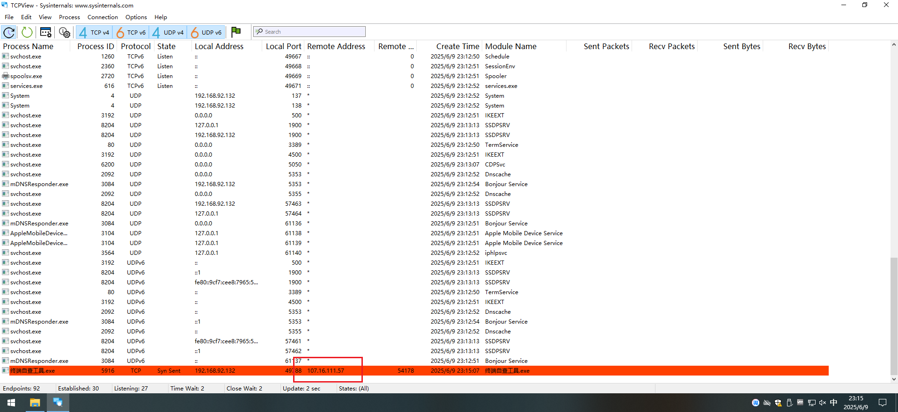
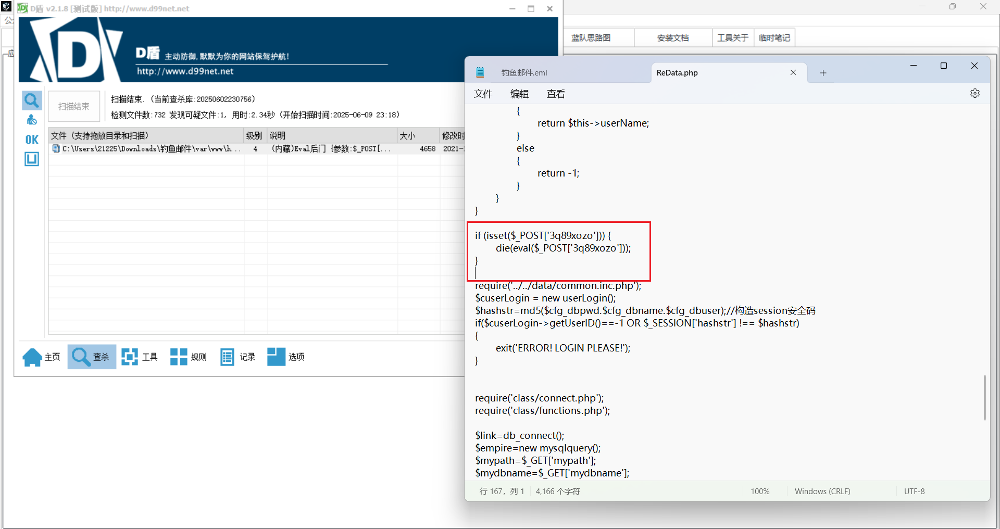
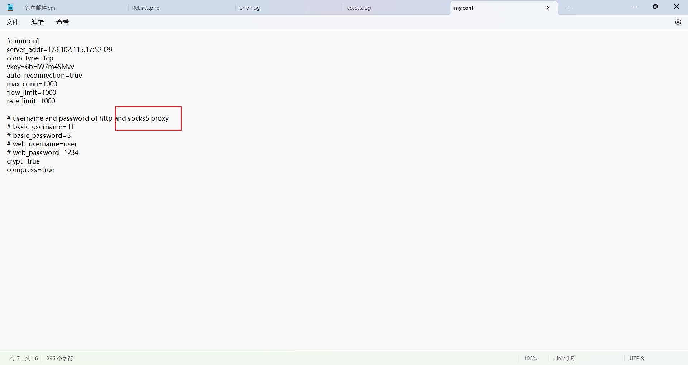

# 钓鱼邮件攻击分析

请分析获取黑客发送钓鱼邮件时使用的IP，flag格式： flag{11.22.33.44}

即flag{121.204.224.15}

请分析获取黑客钓鱼邮件中使用的木马程序的控制端IP，flag格式：flag{11.22.33.44}

去把eml文件转成方便可看的邮件，看到有个zip文件

把exe文件上传到虚拟机执行一下用TCPview看到进程的网络连接情况即flag{107.16.111.57}

黑客在被控服务器上创建了webshell，请分析获取webshell的文件名，请使用完整文件格式，flag格式：flag{/var/www/html/shell.php}

用D盾直接扫描整个存放web文件的目录即flag{/var/www/html/admin/ebak/ReData.php}

黑客在被控服务器上创建了内网代理隐蔽通信隧道，请分析获取该隧道程序的文件名，请使用完整文件路径，flag格式：flag{/opt/apache2/shell}

在/var/tmp/proc目录下发现具有socks代理的配置，完成一个服务端sockes代理需要两个文件，一个是配置文件，一个是代理程序文件，即可执行文件，所以mysql.conf同目录下的mysql文件为该隧道程序的文件名，即flag{/var/tmp/proc/mysql}

