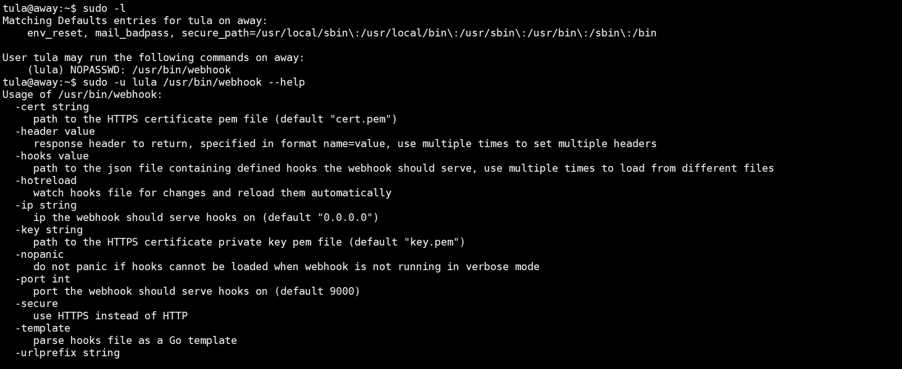

起手就是信息收集 经典双端口组合

如下是以ED25519加密的，还有ECDSA，现在大部分默认是用的rsa算法

其实这种还是存在公私钥对的

然后开始进行提权，sudo -l发现存在webhook，然后看样子是个成型的工具，可以上github搜索

看到启用这个工具要需要一个hooks.json

然后我在tmp目录下写了一个反弹shell的.sh，id为laitya1，命令工作目录为/tmp，这里要记得给.sh文件加上执行权限

  接下来存在能力提权，可以用github对应的提权项目找出来 这里的more存在读和search权限，可以读取shadow文件进行爆破，读取ssh私钥文件进行登录

这是提取工具项目产生的结果

